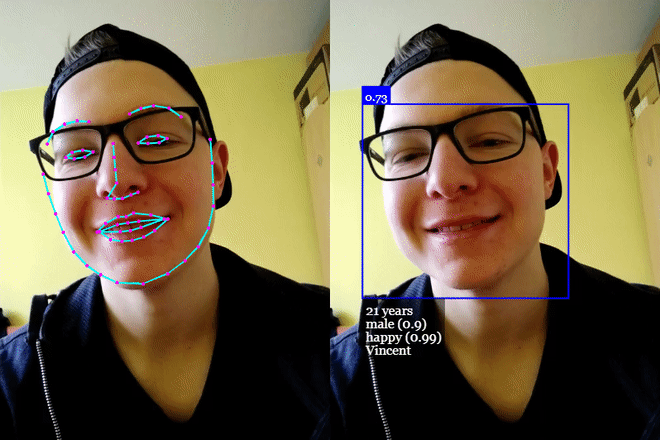
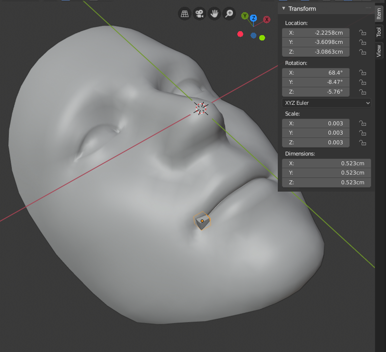

When I first saw Instagram's and Snapchat's filter I thought they were all _magic_.

Later I came to know that it is powered by _AI_ and _3D CGI_. But that still doesn't explain much, right?

In order to build a filter you need to do 3 things:

- Find the face
- Put stuff on the face
- Add color to the effect

So lets dig into it!

# Find the face:

What I mean by find the face: Locate it's position and rotation in three dimensions. If you look around you will probably see this refered as defining the [head pose with 6 degrees of fredom](https://www.researchgate.net/publication/321682530_Real-Time_Monocular_6-DoF_Head_Pose_Estimation_from_Salient_2D_Points).

The approach I used is the one based on this [blog post](https://www.learnopencv.com/head-pose-estimation-using-opencv-and-dlib/) and it goes like this:

1. Locate certain keypoints (nose tip position, left eye position, etc...) in the image.
2. Given an approximated 3D representation of the face, solve the [Perspective-n-Point
   ](https://en.wikipedia.org/wiki/Perspective-n-Point) and get the face's rotation and translation in 3D.

## Locate keypoins

For this task I'm using an **AWESOME** library called [face-api.js](https://github.com/justadudewhohacks/face-api.js/). You give it an image or a video and it will return a list of where are 68 keypoints on a human face.



<center><small>Face-api.js works like a charm!</small></center>

The way it works is best explained at the [project's page](https://github.com/justadudewhohacks/face-api.js/) but in short:

- Find where in the image the face is (the blue square on the right side of the gif), this is done using Tensorflow to run the image through a Neural Network.

- Now that you have only the cropped face apply it to another Neural Network, this one will output positions for the keypoints.

## Solve Perspective-n-Point

Given where the keypoints are we can use an estimated 3D model of the human face and try to rotate and move it around so that it's projection would be the same as the one observed.

We just need a list of the 3D points that correspond to the 2D ones observed in the image, we don't actually need a 3D model at all.

But, of course, having this 3D model makes our life easier because it's now just a matter of measuring it and getting these 3D points.

I just moved a cube to the desired points and the copied and pasted the location Blender (or any other 3D modelling software) would tell me the object is.



<center><small>Getting the points with Blender</small></center>

We would also need to know some parameters about the camera (focal length, center of projection, etc) but we can just approximate them and it works great.

Now just feed your 3D points and 2D points to something like [OpenCV's solvePnP](https://docs.opencv.org/3.4/d9/d0c/group__calib3d.html#ga549c2075fac14829ff4a58bc931c033d) and you're done. It will give you a rotation value and translation values that when applied to the object in 3D would produce the same projection.

The only problem I got using this approach was that currently compiling OpenCV to WASM would produce a binary blob of ~1MB and 300k of JS after spending a whole day trying to decrease this size (it started at around 4MB).

I didn't want to download and parse all of this just to run one function on my client's mobile phone.

That's why [Filtrou.me](https://filtrou.me) uses another AI to solve the PnP. [If you're interested in the details of this AI read the next blog post.](/solve-pnp)

# Put stuff on the face

Great! We now know the rotation and translation to apply to whatever we want to draw over the face.

This couldn't be easier. Here we just use [three.js](https://threejs.org/) to create a scene, camera and an object.

Then we just apply the rotation and translation given in the previous step to this object:

```typescript
export const onResults = (
  q: THREE.Quaternion,
  x: number,
  y: number,
  z: number,
) => {
  threeObject.rotation.setFromQuaternion(q);
  // if you're reading Filtrou.me's source code you'll see that
  // y coordinate is corrected given the video aspect ratio.
  // thats because the solvePnP AI sees the video as a square
  // and we're displaying it with diferent aspect ratios there.
  // If you use OpenCV's solvePnP or a square video with solvePnP AI
  // then the correction won't be needed.
  threeObject.position.set(x, y, z);
};
```

We should match three.js' configuration of FOV to the same as the camera where the picture was taken.

But since we don't know it exactly using an approximation is fine.

Using 45 degrees works fine if the video is squared. Otherwise it will need to be corrected given the image aspect ratio.

# Add colors to the effect

Once again, three.js comes to the rescue.

[There is an awesome library called postprocessing that basically has everything done for you.](https://www.npmjs.com/package/postprocessing)

Here at [Filtrou.me](https://filtrou.me) we use it to apply [some color changes](<(https://threejsfundamentals.org/threejs/lessons/threejs-post-processing-3dlut.html)>) based on some [Color Look Up Tables](https://www.computerhope.com/jargon/c/clut.htm) done in Adobe Photoshop.

# Doubts?

Take a look at [Filtrou.me source code](https://github.com/lucasavila00/ff).
